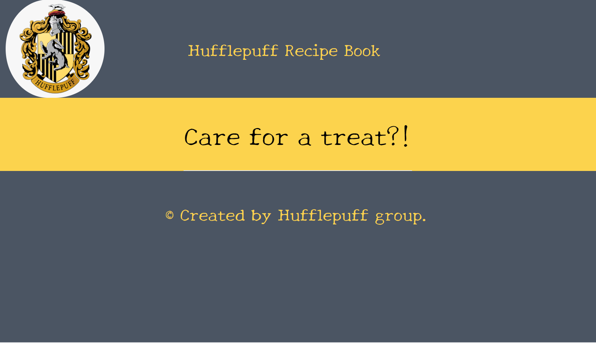
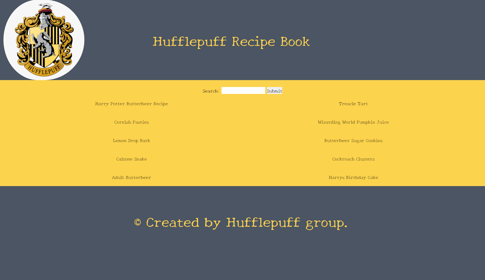
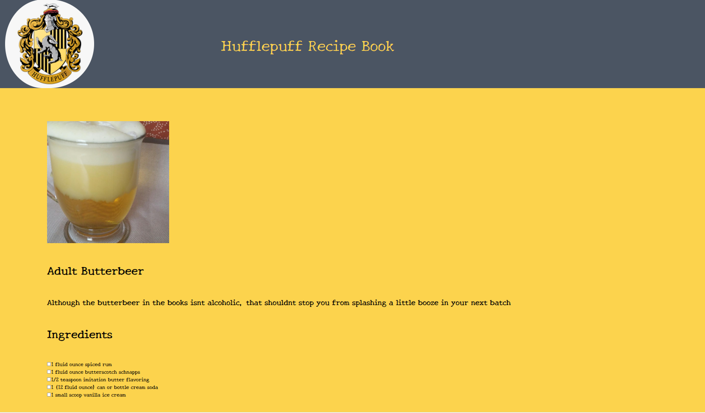

# Harry Potter Recipe Book

One day group project. As a team we decided to create a web based Harry Potter Recipe book.

### From the command line

```bash
npm install # to install dependencies
npm run knex migrate:latest # to reset database
npm run knex seed:run # to get seed data
npm run dev # to start the dev server
```

You can find the server running on [http://localhost:3000](http://localhost:3000).

## User Stories
1. As a user I want to view a single recipe by clicking on it.
2. As a user I want to search in the recipe book for a specific recipe.

## User interface

Home Page|
------------------------------------|
|

Recipe Book Page|Sample Recipe Page
------------------------------------|------------------------------
|


## Details

## Tech Stack
**Client:** JavaScript, HandleBarsJS, HTML and TailwindCSS

**Server:** NodeJS, KnexJS

## Authors
- Johann Besas - [@johannbesas](https://github.com/johannbesas)

- Sina Kakhki - [@sina-kakhki](https://github.com/sina-kakhki)

- Johnny Sainsbury - [@johnny-sainsbury](https://github.com/johnny-sainsbury)

- Karol Bajczyk - [@1Karol1](https://github.com/1Karol1)
